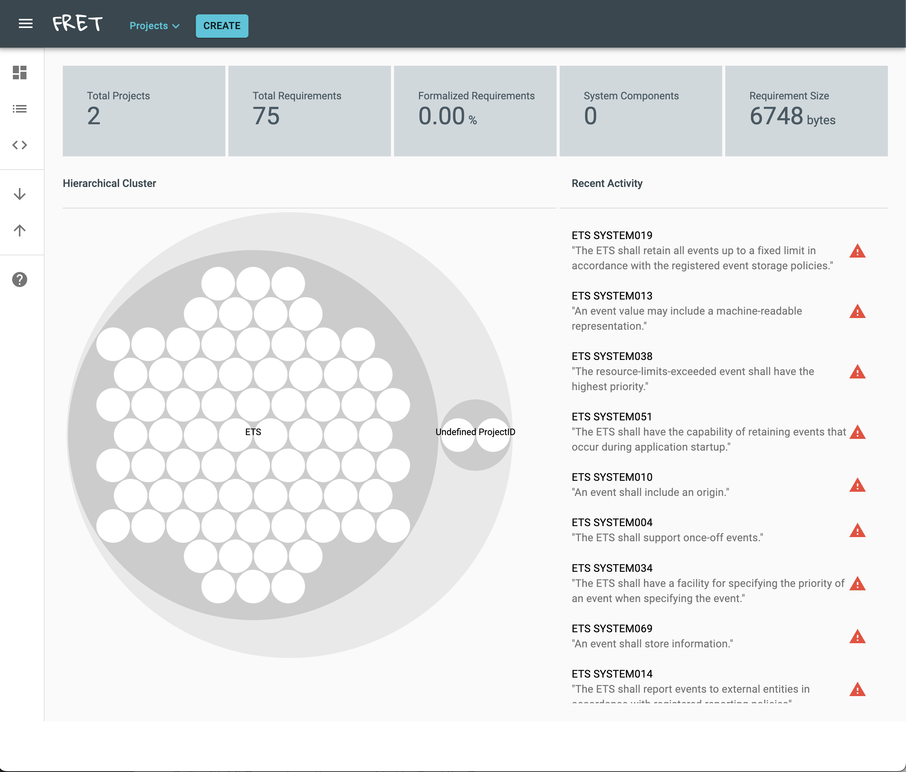
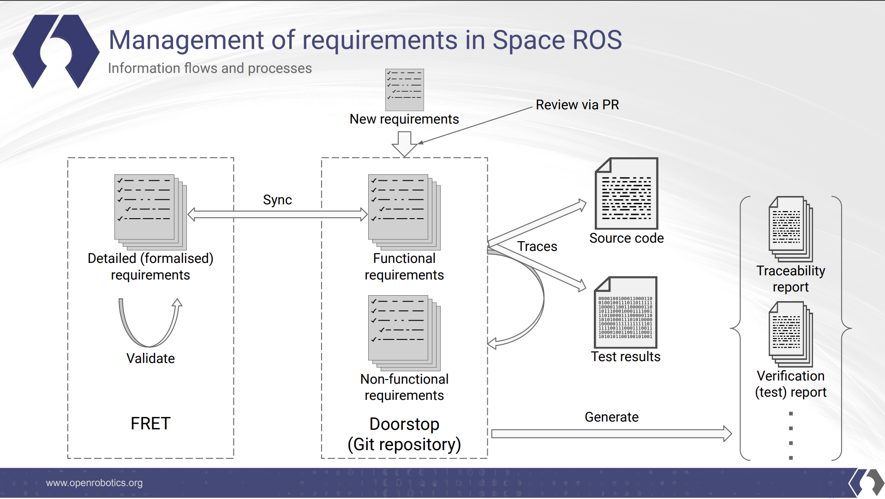

.. _Requirements-Tools-And-Processes:

Requirements Tools and Processes
================================

.. contents:: Table of Contents
   :depth: 1
   :local:

**Goal:** Utilize Doorstop and FRET to create, analyze, and stabilize requirements for a project.
**Tutorial level:** Beginner

**Time:** 10 minutes (not including build time)

Prerequisites
-------------

* `Install Doorstop <https://doorstop.readthedocs.io/en/latest/getting-started/installation/>`__
* `Install FRET <https://github.com/NASA-SW-VnV/fret/blob/master/fret-electron/docs/_media/installingFRET/installationInstructions.md/>`__
* `Clone Requirements Repository <https://github.com/space-ros/requirements/>`__

Introduction
------------

Writing requirements is essential to the development of safety-critical systems, leading to a clear definition of how the system needs to function. Acting as guidelines to that system, it's imperative that requirements aren't ambigious, which can be difficult as they are usually written in formal language.
The system Space ROS uses is meant to be a sync, in which the user writes natural languagerequirements in either yaml or markdown, which is processed and version controlled by :doc:`Doorstop <../Related-Projects/Doorstop.rst>`, then converted to viable code through the :doc:`FRET <../Related-Projects/FRET.rst>` pipeline.
"The creation and integration of these monitors is intended
to be as seamless as possible; the properties to be monitored are written in FRETish, and
little to no code is required to be written by hand."

Tasks
-----
1. Create a Parent Document
^^^^^^^^^^^^^^^^^^^^^^^^^^^
``Doorstop`` begins each of its projects with a main yaml control file to make unity easy.
First, head to the top of your working directory, using the requirements repository you should end up with this tree.

.. code-block:: console

   ets/
   └── docs/
   ├── system_requirements/
       └── .doorstop.yml
       ├── SYSTEM001.md
       ├── SYSTEM002.md
       ├── ...
       ├── SYSTEM073.md

This mimics the essential command each ``Doorstop`` project starts with, which is creating that top level document. This set of requirements can be then be added to any version control system through ``git`` which allows us to trace, blame, and see the development of our requirements.

.. code-block:: console

   doorstop create SYSTEM ./system_requirements

1.1 Analyze .doorstop.yml
^^^^^^^^^^^^^^^^^^^^^^^^^
A look into the ``.doorstop.yml`` file should reveal the following:

.. code-block:: yaml

  settings:
    digits: 3
    itemformat: markdown
    prefix: SYSTEM
    sep: ''

These 4 settings will affect the rest of the document for the duration of the project.

* **digits** -- The number of digits in an Item UID, seen in the 3 numbers after SYSTEM in each markdown file.
* **itemformat** -- The supported file type that can be converted into FRETish language, either ``yaml`` or ``markdown``.
* **prefix** -- The parent document's prefix, a read-only setting, in our case it is ``SYSTEM``.
* **sep** -- The separator between each document prefix and the number, in our case there is no separator between SYSTEM and the 3 digits.

1.2 Analyze Requirements Files
^^^^^^^^^^^^^^^^^^^^^^^^^^^^^^
A look into any of the requirements files like ``SYSTEM001.md``, should showcase the shown format:

.. code-block:: markdown

    ---
    active: true
    derived: false
    level: 1
    links: []
    normative: true
    ref: ''
    reviewed: none
    ---

    The ETS shall store events that occur in the spacecraft.

* **active** -- Determines if the item should be published during export, a boolean.
* **derived** -- Determines if the item was derived, a boolean.
* **level** -- Determines the presentation order within the document as a whole, a float.
* **links** -- A list of links to parent item(s), along with the relationship of those items.
* **normative** -- Determines if the item is part of the standard, a boolean.
* **ref** -- A reference to an external file which needs to be established.
* **reviewed** -- Determines if the item has been reviewed, along with the fingerprinted hash alorgithm, a Base64 encoding.

2. Export the Information to FRETish Language
^^^^^^^^^^^^^^^^^^^^^^^^^^^^^^^^^^^^^^^^^^^^^
Now that we have a slew of requirements, our system guidelines must be exported to a format which FRET can read.

.. code-block:: console

   doorstop export SYSTEM ./system.csv

3. Import Requirements to FRET
^^^^^^^^^^^^^^^^^^^^^^^^^^^^^^
With the ``Fret`` GUI we can take advantage of our requirements in ``.csv`` form in order to analyze them. Enter the ``Fret`` repository after it was installed earlier, then open the GUI.

.. code-block:: console

   cd fret-electron
   npm start

The FRET GUI will begin with just a basic untitled project, so we must create a project, we can create a new one when we import our list of requirements. On the left side bar, select the import option (the downward facing arrow), then import the ``system.csv`` file. Complete the following settings by default:

* **Requirement ID** -- ``uid``
* **Requirement Description** -- ``text``
* **Project ID** -- Create new Project
* **Project ID Name** -- Create a custom a name

Your FRET page should look similar to the following, from here we can begin to analyze our requirements.

* Red bubbles indicate requirements that aren't expressed in correct FRETish and therefore aren't formalized.
* Green bubbles have been correctly parsed in FRETish and formalized.
* White bubbles indicate requirements that are empty or that have been entered within quotes, indicating that parsing in FRETish has not been attempted.

After importing a requirements list like the original ETS system, most of the bubbles will be white, that is because FRETish requirements are more detailed than basic requirements. Requirements through Doorstop are meant to be either functional or nonfunctional, in which functional documents can be synched to FRET and be imporved in detail. This can be seen in OSRF's management of requirements flow chart.

